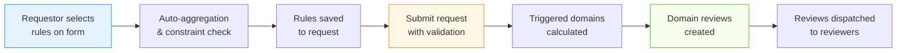
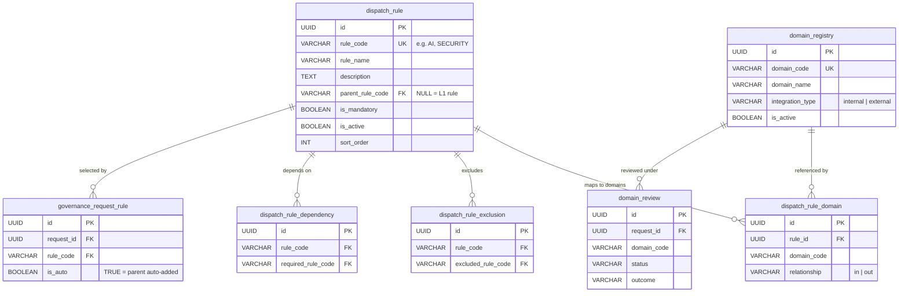
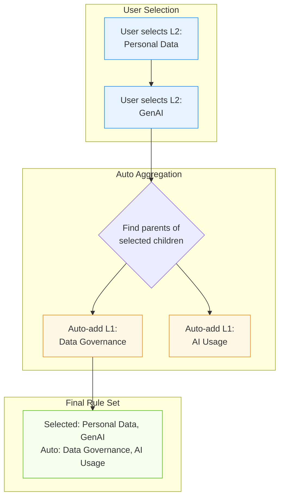
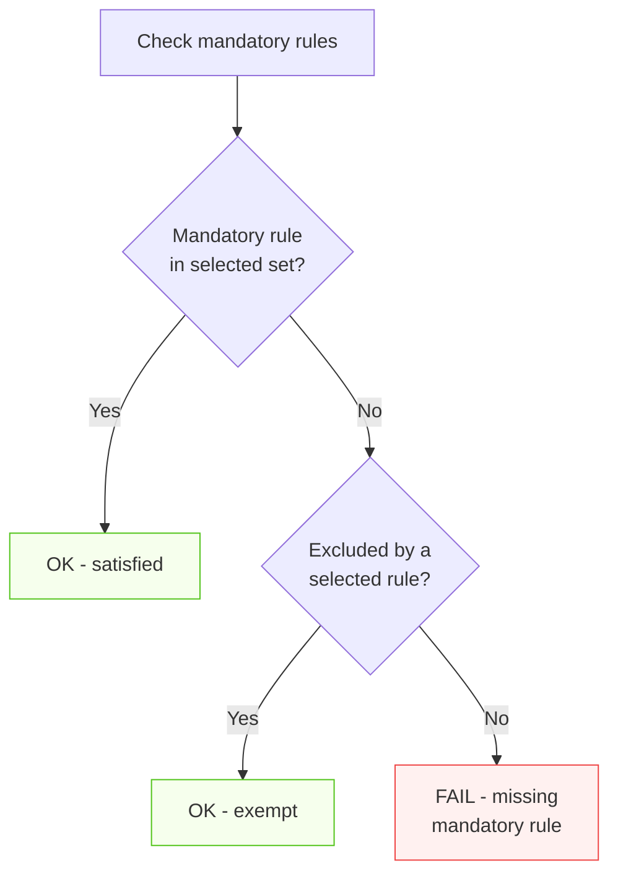
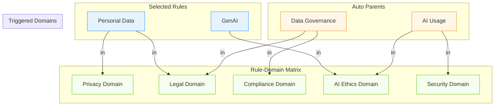
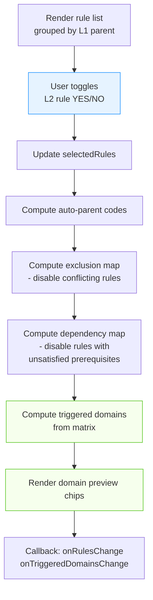
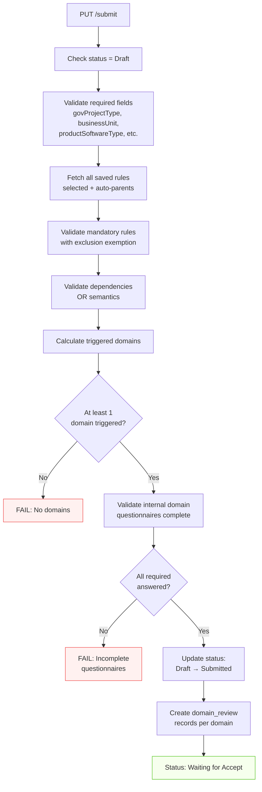
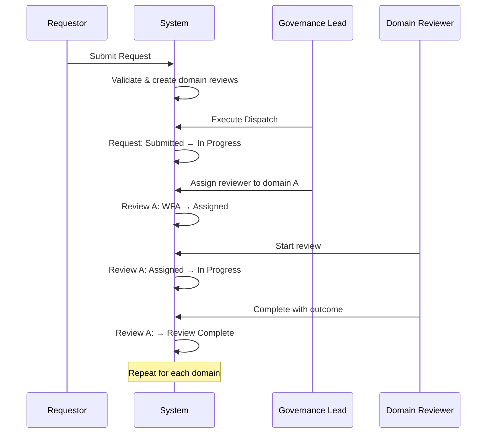

# Domain Review & Rule Dispatch Mechanism

This document describes how governance domains are determined from dispatch rules, and how domain reviews are created and dispatched.

---

## 1. Overview

The dispatch system connects **Requestor intent** (selecting applicable rules) to **Governance outcomes** (domain-specific reviews). The flow is:



---

## 2. Data Model

### Entity Relationship



### Table Descriptions

| Table | Purpose |
|-------|---------|
| `dispatch_rule` | Rule definitions with 2-level hierarchy (L1 parent → L2 children) |
| `dispatch_rule_domain` | Matrix mapping each rule to domains (`'in'` = triggers, `'out'` = does not trigger) |
| `dispatch_rule_exclusion` | Mutual exclusion pairs (bidirectional) |
| `dispatch_rule_dependency` | Prerequisite requirements (unidirectional, OR semantics) |
| `governance_request_rule` | Junction table: which rules a request has selected |
| `domain_registry` | Governance domain definitions (internal vs external) |
| `domain_review` | Created on submission, one per triggered domain per request |

---

## 3. Rule Hierarchy (L1 / L2)

Rules are organized in a **two-level hierarchy**:

```
L1: Data Governance          (parent, rule_code = "DATA_GOV")
  ├── L2: Personal Data      (child, parent_rule_code = "DATA_GOV")
  ├── L2: Cross-border Data  (child, parent_rule_code = "DATA_GOV")
  └── L2: Data Retention     (child, parent_rule_code = "DATA_GOV")

L1: AI Usage                 (parent, rule_code = "AI")
  ├── L2: GenAI              (child, parent_rule_code = "AI")
  └── L2: ML Models          (child, parent_rule_code = "AI")

L1: Security Review          (standalone L1, no children)
```

**Key behaviors:**
- L1 rules are **header-level** — they appear as section titles in the UI
- L2 rules are **selectable** — the requestor toggles YES/NO on each
- L1 rules with children are **not directly selectable** — they are auto-included when any child is selected
- L1 rules without children **are selectable** (standalone rules)

---

## 4. Auto-Parent Aggregation

When a requestor selects an L2 child rule, the L1 parent is **automatically included** in the rule set.



**Backend implementation** (on save):
```sql
-- 1. Save user-selected rules (is_auto = FALSE)
INSERT INTO governance_request_rule (request_id, rule_code, is_auto)
VALUES (:rid, :user_selected_code, FALSE);

-- 2. Auto-add parent rules (is_auto = TRUE)
INSERT INTO governance_request_rule (request_id, rule_code, is_auto)
SELECT :rid, parent_rule_code, TRUE
FROM dispatch_rule
WHERE rule_code = ANY(:selected_codes)
  AND parent_rule_code IS NOT NULL
  AND is_active = TRUE;
```

---

## 5. Constraint System

### 5.1 Mutual Exclusions

Two rules that cannot be selected together.

**Scoping rules:**
- L1 can exclude L1 only
- L2 can exclude sibling L2 only (same parent)

**Behavior:** When rule A is selected and A excludes B, rule B is disabled in the UI. If B was previously selected, it is automatically deselected.

**Auto-parent cascading:** If an auto-aggregated parent is excluded, all of its children are also disabled.

### 5.2 Dependencies (Prerequisites)

A rule may require one or more other rules to be active.

**OR semantics:** If rule A depends on [B, C], then A can be selected if **at least one** of B or C is active (directly selected or auto-aggregated).

**Cascade behavior:** If a rule is deselected and another rule's only remaining dependency was that rule, the dependent rule is also deselected.

### 5.3 Mandatory Rules

Rules marked `is_mandatory = TRUE` must be present in the final rule set.

**Exclusion exemption:** A mandatory rule is exempt if it is **excluded by** a selected rule. This prevents impossible validation states.



---

## 6. Domain Triggering

Domains are triggered based on the **rule ↔ domain matrix**. The `dispatch_rule_domain` table stores `relationship = 'in'` (triggers) or `'out'` (does not trigger) for each rule-domain pair.



**Domain calculation combines:**
1. Domains from user-selected rules (L1 standalone or L2)
2. Domains from auto-aggregated L1 parent rules

```sql
SELECT DISTINCT crd.domain_code
FROM governance_request_rule grr
JOIN dispatch_rule cr ON cr.rule_code = grr.rule_code AND cr.is_active = TRUE
JOIN dispatch_rule_domain crd ON crd.rule_id = cr.id AND crd.relationship = 'in'
WHERE grr.request_id = :rid
```

---

## 7. Frontend: GovernanceScopeDetermination Component

The `GovernanceScopeDetermination` component (`frontend/src/app/governance/_components/GovernanceScopeDetermination.tsx`) implements the rule selection UI.

### Data Source

Fetches `GET /dispatch-rules/matrix` which returns:

```typescript
{
  rules: [{ ruleCode, ruleName, parentRuleCode, isMandatory, sortOrder }],
  domains: [{ domainCode, domainName }],
  matrix: { [ruleCode]: { [domainCode]: "in" | "out" } },
  exclusions: { [ruleCode]: [excludedCodes...] },
  dependencies: { [ruleCode]: [requiredCodes...] }  // OR semantics
}
```

### UI Flow



### Visual Layout

Each L1 rule appears as a **section header**. Its L2 children appear below with YES/NO toggle buttons:

```
┌──────────────────────────────────────────────┐
│ Data Governance                    [Auto ✓]  │
│  ├── Personal Data          [YES] / [ NO ]   │
│  ├── Cross-border Data      [ YES] / [NO ]   │
│  └── Data Retention         [YES] / [ NO ]   │
├──────────────────────────────────────────────┤
│ AI Usage                           [Auto ✓]  │
│  ├── GenAI                  [YES] / [ NO ]   │
│  └── ML Models              [ YES] / [NO ]   │
├──────────────────────────────────────────────┤
│ Security Review             [YES] / [ NO ]   │
│ (standalone L1 — directly selectable)        │
└──────────────────────────────────────────────┘

Triggered Domains:
[Privacy] [Legal] [Compliance] [AI Ethics] [Security]
```

---

## 8. Submission & Domain Review Creation

### Validation Pipeline



### Domain Review Creation

On successful submission:

```sql
INSERT INTO domain_review (request_id, domain_code, status, create_by, update_by)
SELECT :request_id, domain_code, 'Waiting for Accept', :user, :user
FROM (
    SELECT DISTINCT crd.domain_code
    FROM governance_request_rule grr
    JOIN dispatch_rule cr ON cr.rule_code = grr.rule_code AND cr.is_active = TRUE
    JOIN dispatch_rule_domain crd ON crd.rule_id = cr.id AND crd.relationship = 'in'
    WHERE grr.request_id = :rid
) triggered
ON CONFLICT (request_id, domain_code) DO NOTHING;
```

Each triggered domain gets exactly one `domain_review` record. The review follows its own lifecycle (see [State Machine](./state-machine.md)).

---

## 9. Dispatch Execution

After submission, a Governance Lead or Admin can **execute the dispatch** via `POST /dispatcher/execute/{requestId}`:

1. Transitions request from **Submitted** → **In Progress**
2. Domain reviews remain in **Waiting for Accept** status until reviewers are assigned and begin work



---

## 10. API Endpoints

### Dispatch Rules Management

| Method | Endpoint | Description |
|--------|----------|-------------|
| `GET` | `/dispatch-rules/` | List all rules with relationships |
| `GET` | `/dispatch-rules/matrix` | Full matrix for frontend UI |
| `GET` | `/dispatch-rules/{code}` | Single rule detail |
| `POST` | `/dispatch-rules/` | Create new rule |
| `PUT` | `/dispatch-rules/{code}` | Update rule |
| `DELETE` | `/dispatch-rules/{code}` | Soft-delete (toggle is_active) |
| `PUT` | `/dispatch-rules/matrix` | Batch update domain relationships |
| `PUT` | `/dispatch-rules/exclusions` | Batch update exclusion pairs |
| `PUT` | `/dispatch-rules/dependencies` | Batch update dependencies |
| `PUT` | `/dispatch-rules/reorder` | Update sort_order |

### Request-Level Rule Operations

| Method | Endpoint | Description |
|--------|----------|-------------|
| `PUT` | `/governance-requests/{id}` | Save selected `ruleCodes` (Draft only) |
| `PUT` | `/governance-requests/{id}/submit` | Validate rules & create domain reviews |

### Dispatcher

| Method | Endpoint | Description |
|--------|----------|-------------|
| `POST` | `/dispatcher/execute/{id}` | Transition Submitted → In Progress |

---

## Source Files

| File | Role |
|------|------|
| `backend/app/routers/dispatch_rules.py` | Rule CRUD, matrix, exclusions, dependencies API |
| `backend/app/routers/governance_requests.py` | Rule save on update, submit validation & domain review creation |
| `backend/app/routers/dispatcher.py` | Execute dispatch transition |
| `backend/app/routers/domain_reviews.py` | Domain review lifecycle endpoints |
| `frontend/src/app/governance/_components/GovernanceScopeDetermination.tsx` | Rule selection UI component |
| `scripts/schema.sql` | All table definitions |
