# EGM State Machine

This document describes the complete status lifecycle for **Governance Requests** and **Domain Reviews** in the EGM system.

---

## 1. Governance Request — Workflow Status

A governance request progresses through a simple linear workflow. Submit auto-creates domain reviews; the first Accept triggers In Progress; all terminal reviews trigger Complete.

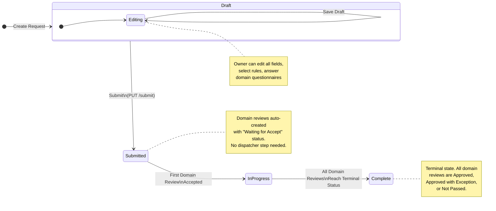

### Transition Details

| # | From | To | Trigger | Who | Conditions | Side Effects |
|---|------|----|---------|-----|------------|--------------|
| 1 | **Draft** | **Submitted** | `PUT /{id}/submit` | Requestor (owner) | All required fields filled; mandatory rules satisfied; rule dependencies met; at least 1 domain triggered; required domain questionnaires answered | Creates `domain_review` records (status = "Waiting for Accept") for each triggered domain |
| 2 | **Submitted** | **In Progress** | First `PUT /domain-reviews/{id}/accept` | Domain Reviewer / Governance Lead | At least one domain review accepted | Automatic — triggered when the first domain review transitions to "Accept" |
| 3 | **In Progress** | **Complete** | All reviews terminal | System (automatic) | All domain reviews in terminal status (Approved, Approved with Exception, or Not Passed) | Automatic — checked after each terminal transition via `_check_auto_complete()` |

> **Note:** Requestors can edit request fields and domain questionnaire answers in any status except Complete. All changes are tracked in `governance_request_change_log`.

---

## 2. Governance Request — Lifecycle Status

Lifecycle status is an **orthogonal dimension** independent of the workflow status. It controls visibility in the request list.

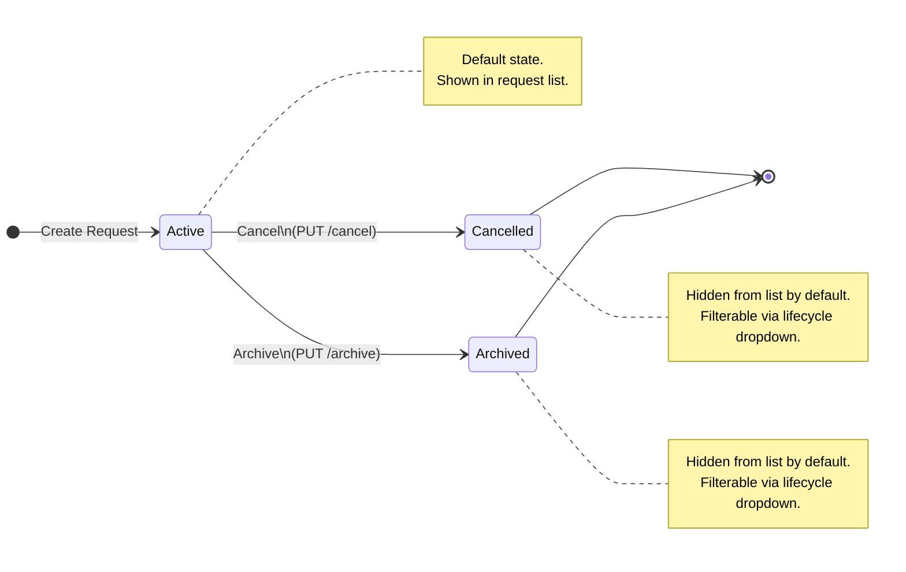

### Transition Details

| # | From | To | Endpoint | Who | Conditions |
|---|------|----|----------|-----|------------|
| 1 | **Active** | **Cancelled** | `PUT /{id}/cancel` | Requestor (owner) | Workflow status must be **Draft** |
| 2 | **Active** | **Archived** | `PUT /{id}/archive` | Admin / Governance Lead | Workflow status must be **Complete** |

> Cancelled and Archived are **terminal states** — no transitions back to Active.

---

## 3. Domain Review — Status Lifecycle

Each governance request can have multiple domain reviews (one per triggered governance domain). Each review follows a 6-state lifecycle.

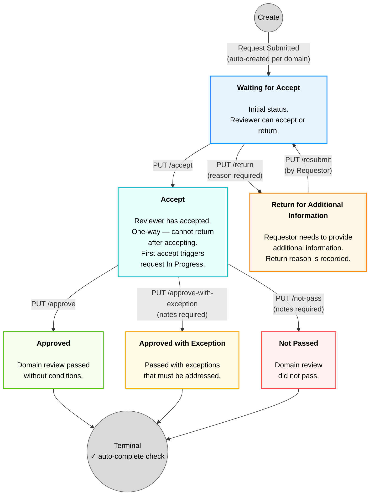

### Transition Details

| # | From | To | Endpoint | Who | Conditions | Side Effects |
|---|------|----|----------|-----|------------|--------------|
| 1 | *(created)* | **Waiting for Accept** | `PUT /{requestId}/submit` | System | Automatic on request submission | One review per triggered domain |
| 2 | **Waiting for Accept** | **Accept** | `PUT /{reviewId}/accept` | Domain Reviewer / Governance Lead | — | Sets `reviewer`, `started_at`; if request is Submitted → In Progress |
| 3 | **Waiting for Accept** | **Return for Additional Information** | `PUT /{reviewId}/return` | Domain Reviewer / Governance Lead | Return reason required | Sets `return_reason`; does **NOT** change request status |
| 4 | **Return for Additional Information** | **Waiting for Accept** | `PUT /{reviewId}/resubmit` | Requestor | — | Clears `return_reason` |
| 5 | **Accept** | **Approved** | `PUT /{reviewId}/approve` | Domain Reviewer / Governance Lead | — | Sets `completed_at`; triggers auto-complete check |
| 6 | **Accept** | **Approved with Exception** | `PUT /{reviewId}/approve-with-exception` | Domain Reviewer / Governance Lead | — | Sets `outcome_notes`, `completed_at`; triggers auto-complete check |
| 7 | **Accept** | **Not Passed** | `PUT /{reviewId}/not-pass` | Domain Reviewer / Governance Lead | — | Sets `outcome_notes`, `completed_at`; triggers auto-complete check |

### Terminal Statuses

| Status | Meaning |
|--------|---------|
| **Approved** | Domain review passed without conditions |
| **Approved with Exception** | Passed with exceptions that must be addressed |
| **Not Passed** | Domain review did not pass |

### Key Rules

- **Accept is one-way**: Once a review is accepted, it cannot be returned. The reviewer must proceed to a terminal decision.
- **Return does not change request status**: Unlike the old system, returning a review does NOT move the governance request to a different status.
- **Auto-complete**: When ALL domain reviews for a request reach terminal status, the request automatically transitions to Complete.
- **Race condition prevention**: Auto-complete uses `SELECT FOR UPDATE` to prevent duplicate transitions when two reviewers complete simultaneously.

### Status Change Logic

#### PUT /accept

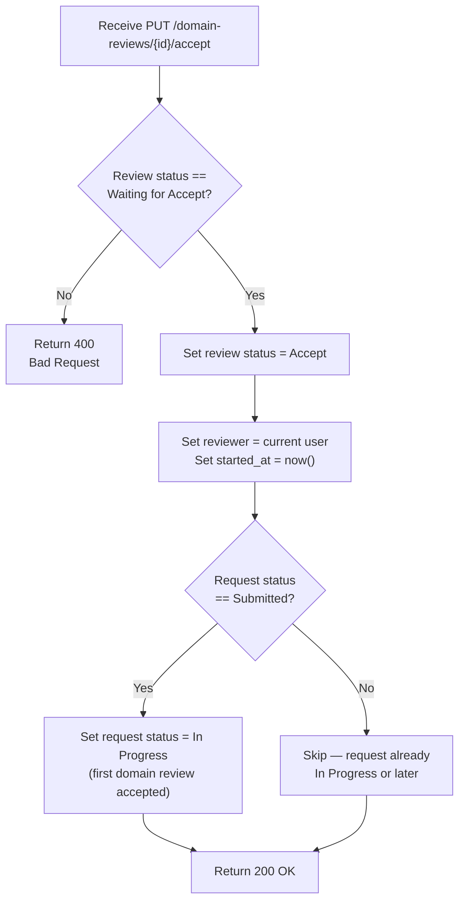

#### PUT /return

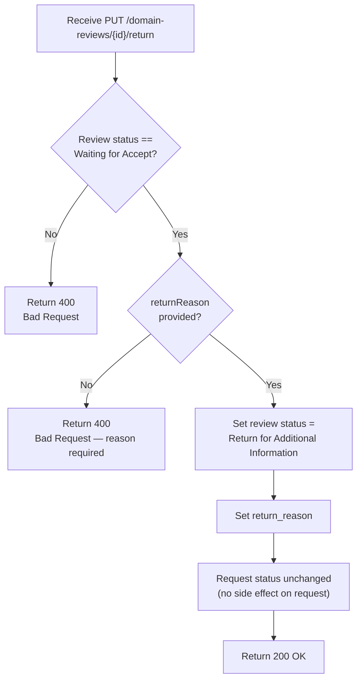

#### PUT /resubmit

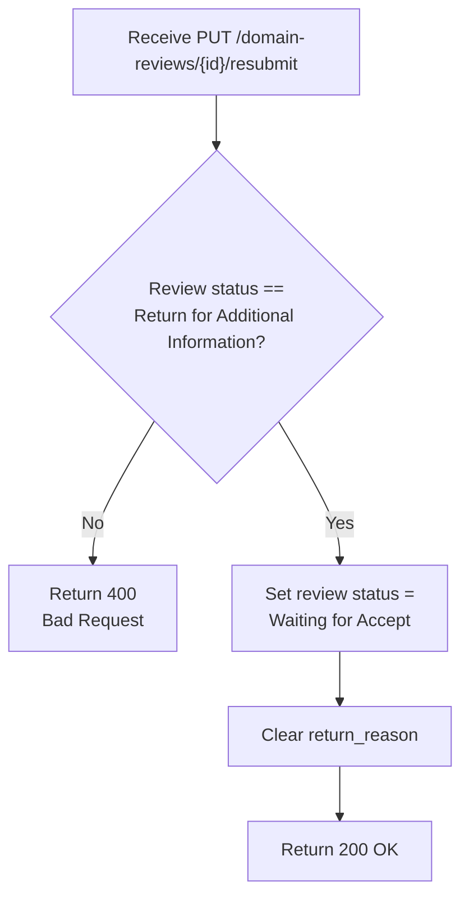

#### PUT /approve

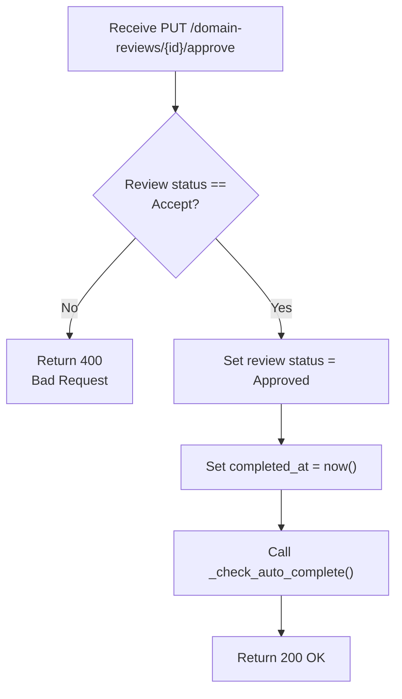

#### PUT /approve-with-exception

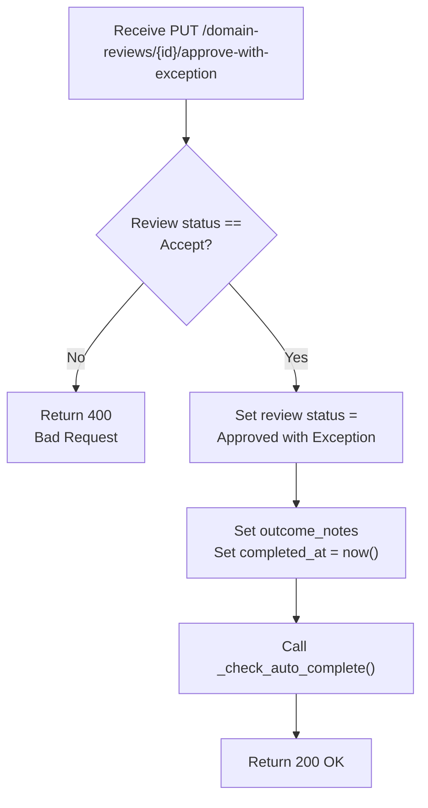

#### PUT /not-pass

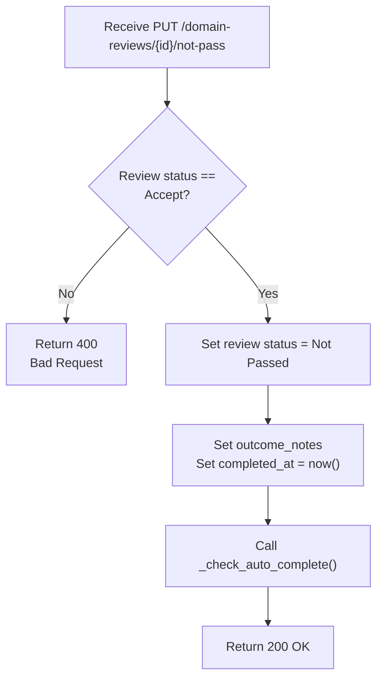

#### _check_auto_complete(request_id)

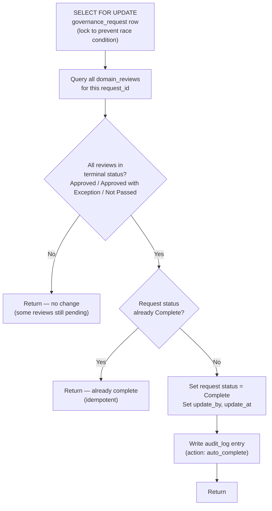

---

## 4. Permission Matrix

### Governance Request Actions

| Action | Requestor (Owner) | Domain Reviewer | Governance Lead | Admin |
|--------|:-:|:-:|:-:|:-:|
| Create / Edit Draft | Yes | — | — | — |
| Submit | Yes | — | — | — |
| Edit after Submit | Yes | — | — | — |
| Cancel (Draft) | Yes | — | — | Yes |
| Archive (Complete) | — | — | Yes | Yes |
| Copy | Yes | — | — | — |

### Domain Review Actions

| Action | Requestor | Domain Reviewer | Governance Lead | Admin |
|--------|:-:|:-:|:-:|:-:|
| Accept | — | Own domains | Yes | Yes |
| Return for Info | — | Own domains | Yes | Yes |
| Resubmit | Yes | — | — | — |
| Approve | — | Own domains | Yes | Yes |
| Approve with Exception | — | Own domains | Yes | Yes |
| Not Pass | — | Own domains | Yes | Yes |

---

## 5. Combined View — Request + Domain Review Interaction

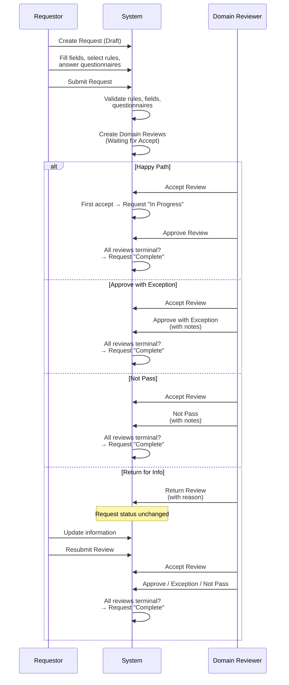

### Multi-Domain Example

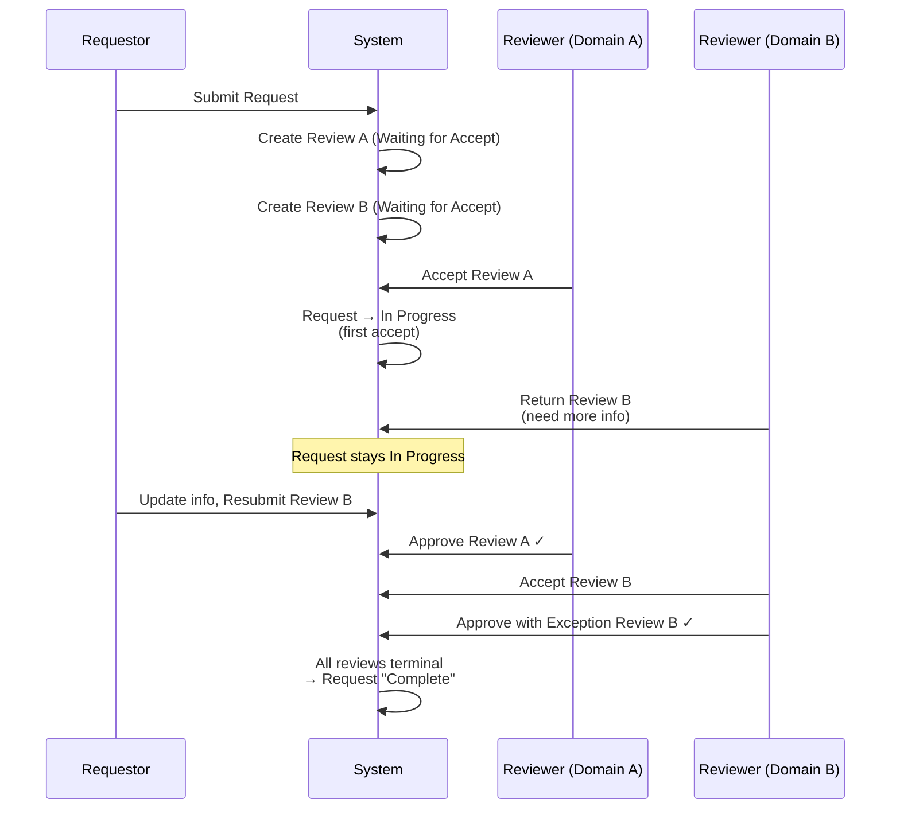

---

## 6. Progress Calculation

The `/progress/{requestId}` endpoint calculates review progress:

| Metric | Calculation |
|--------|-------------|
| **Completed domains** | Reviews where `status IN ('Approved', 'Approved with Exception', 'Not Passed')` |
| **In progress domains** | Reviews where `status = 'Accept'` |
| **Pending domains** | Reviews where `status IN ('Waiting for Accept', 'Return for Additional Information')` |
| **Progress percent** | `(completed / total) * 100` |

---

## 7. Review Action Item — Status Lifecycle

Each domain review (in "Accept" status) can have multiple action items. Actions track follow-up tasks assigned to the requestor or other stakeholders. Actions can only be **created** while the parent domain review is in "Accept" status.

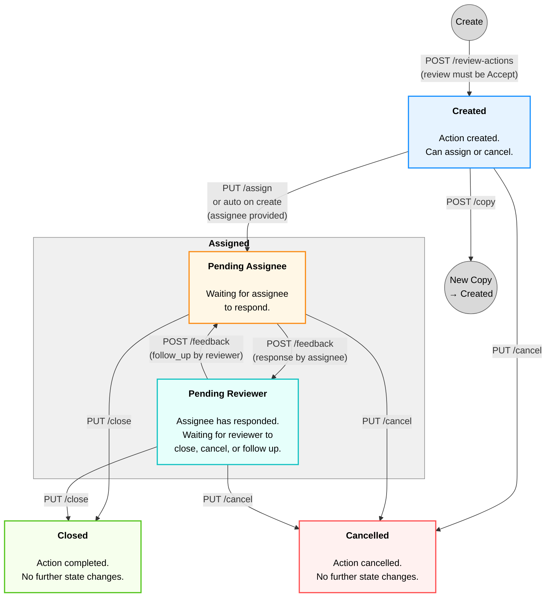

### Pending Side (within Assigned)

The DB status remains `Assigned` throughout. The **pending side** is derived at query time from the last feedback entry — no additional status column required.

| Last Feedback | Pending Side | Who Needs to Act | Portal Shows? |
|---|---|---|---|
| *(none — just assigned)* | **Assignee** | Assignee responds | Yes |
| `follow_up` (reviewer) | **Assignee** | Assignee responds | Yes |
| `response` (assignee) | **Reviewer** | Reviewer closes / follows up | No |

**Derivation logic** (SQL):
```sql
LEFT JOIN LATERAL (
    SELECT feedback_type FROM review_action_feedback
    WHERE action_id = ra.id ORDER BY create_at DESC LIMIT 1
) lf ON true
-- Pending assignee when: no feedback, or last is follow_up
WHERE lf.last_feedback_type IS NULL OR lf.last_feedback_type != 'response'
```

The `pendingSide` field (`"assignee"` | `"reviewer"` | `null`) is returned in the `GET /review-actions` and `GET /review-actions/by-request/{id}` responses.

### Transition Details

| # | From | To | Endpoint | Who | Conditions | Side Effects |
|---|------|----|----------|-----|------------|--------------|
| 1 | *(new)* | **Created** | `POST /review-actions` | Reviewer / Lead | `domain_review.status = 'Accept'` | If assignee provided → auto-transition to Assigned (Pending Assignee) |
| 2 | **Created** | **Assigned** (Pending Assignee) | `PUT /{id}/assign` or auto | Reviewer / Lead | — | Sets assignee; sends email notification |
| 3 | **Assigned** (Pending Assignee) | **Assigned** (Pending Reviewer) | `POST /{id}/feedback` | Assignee | — | Adds `response` feedback; bumps `update_at`; notifies reviewer; action disappears from assignee's portal |
| 4 | **Assigned** (Pending Reviewer) | **Assigned** (Pending Assignee) | `POST /{id}/feedback` | Reviewer | — | Adds `follow_up` feedback; bumps `update_at`; notifies assignee; action reappears on assignee's portal |
| 5 | **Assigned** | **Closed** | `PUT /{id}/close` | Reviewer / Lead | — | Sets `closed_at`; sends email |
| 6 | **Created \| Assigned** | **Cancelled** | `PUT /{id}/cancel` | Reviewer / Lead | — | Sets `cancelled_at` |
| 7 | any | *(new copy)* | `POST /{id}/copy` | Reviewer / Lead | — | Creates duplicate (status=Created, no feedback) |

### Key Rules

- **Creation guard**: Actions can only be created when `domain_review.status = 'Accept'`. If the review is in any other status (Waiting for Accept, Return, Approved, etc.), creation returns 400.
- **Default assignee**: If no assignee specified, defaults to the governance request's requestor and auto-assigns.
- **Cannot close Created**: An action must be Assigned before it can be Closed. Cancel is allowed from either state.
- **Terminal actions are immutable**: Closed and Cancelled actions cannot have further state changes.
- **Feedback on terminal reviews**: After a domain review reaches terminal status (Approved/Exception/Not Passed), existing actions remain but no new actions can be created. Feedback submission on open actions is still allowed.
- **Multi-round feedback**: Assignee submits `response`, reviewer submits `follow_up`. Each assignee response increments `round_no`.
- **Pending side derived, not stored**: The pending side is computed from the most recent feedback entry at query time. This avoids schema changes and ensures consistency with the feedback history.
- **Interaction timestamps**: Every feedback submission bumps `review_action.update_at`, enabling time-consumption analytics (response latency, turnaround time per round).

### Feedback Flow

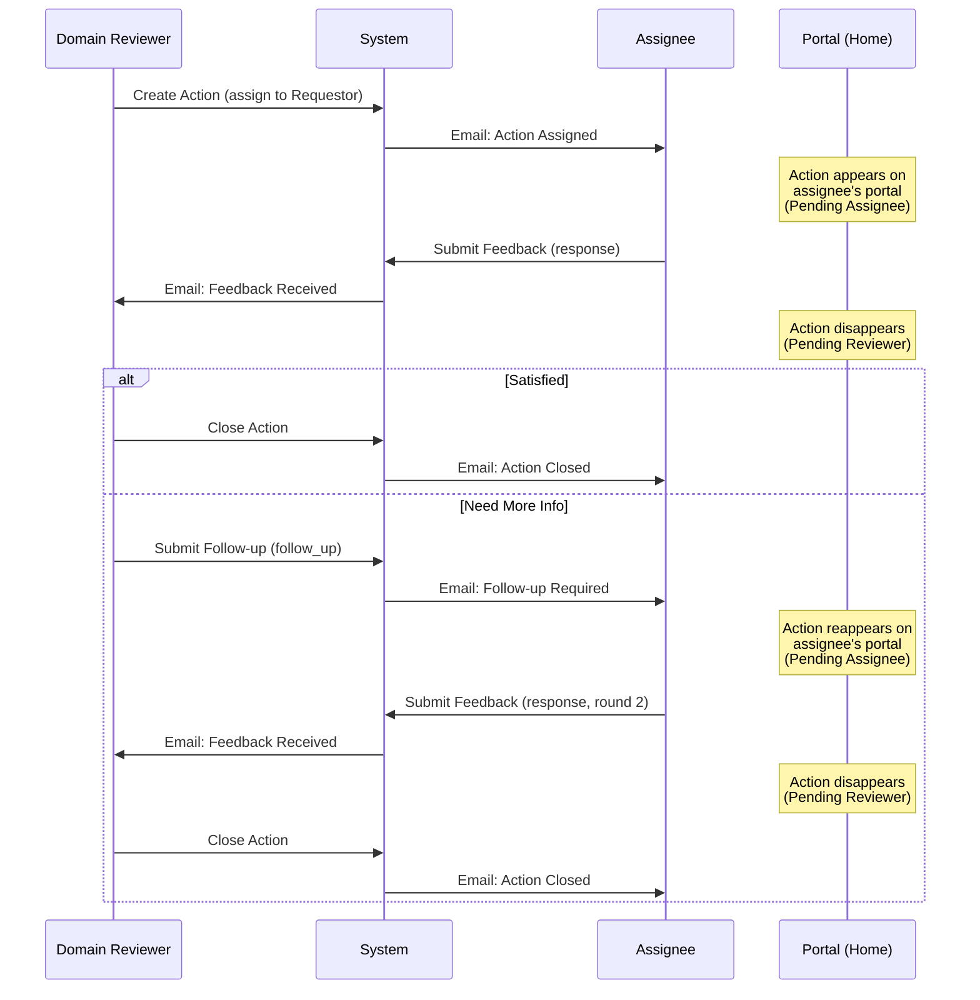

### Time Tracking

Each feedback interaction updates `review_action.update_at`, and each feedback entry has its own `create_at` timestamp. This enables future analytics:

| Metric | Calculation |
|--------|-------------|
| **Assignee response time** | `response.create_at` − `MAX(assign_time, previous follow_up.create_at)` |
| **Reviewer turnaround** | `follow_up.create_at` − `previous response.create_at` |
| **Total action duration** | `closed_at` − `create_at` |
| **Rounds to resolution** | `MAX(round_no)` from feedback entries |

### Permission Matrix

| Action | Requestor (Assignee) | Domain Reviewer | Governance Lead | Admin |
|--------|:-:|:-:|:-:|:-:|
| Create Action | — | Own domains | Yes | Yes |
| Assign | — | Own domains | Yes | Yes |
| Submit Feedback (response) | Yes (if assignee) | — | — | — |
| Submit Feedback (follow_up) | — | Own domains | Yes | Yes |
| Close | — | Own domains | Yes | Yes |
| Cancel | — | Own domains | Yes | Yes |
| Copy | — | Own domains | Yes | Yes |
| View Actions | Yes | Yes | Yes | Yes |

### Integration with Domain Review Lifecycle

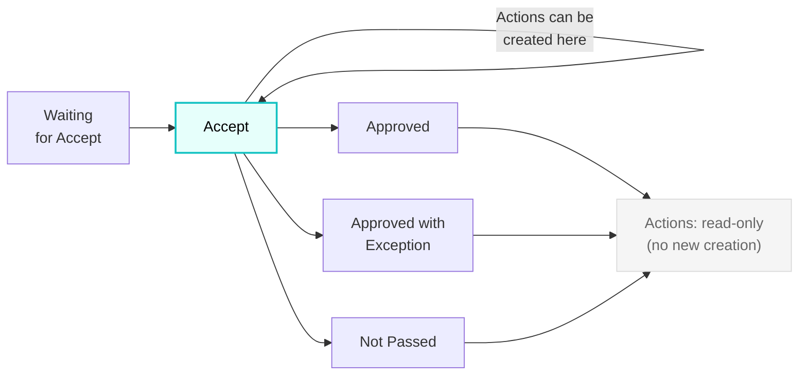

---

## Source Files

| File | Role |
|------|------|
| `backend/app/routers/governance_requests.py` | Submit, cancel, archive, copy endpoints |
| `backend/app/routers/domain_reviews.py` | Accept, return, resubmit, approve, approve-with-exception, not-pass |
| `backend/app/routers/progress.py` | Progress calculation |
| `scripts/schema.sql` | Table definitions |
| `backend/app/routers/review_actions.py` | Action item CRUD, state transitions, feedback |
| `frontend/src/lib/constants.ts` | Status color mappings |
