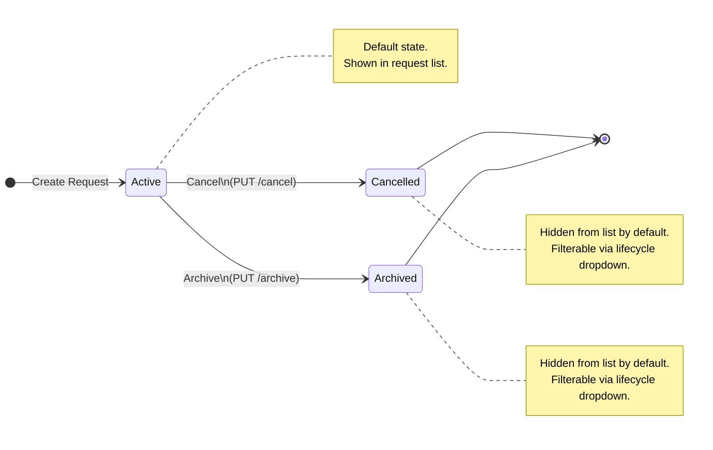
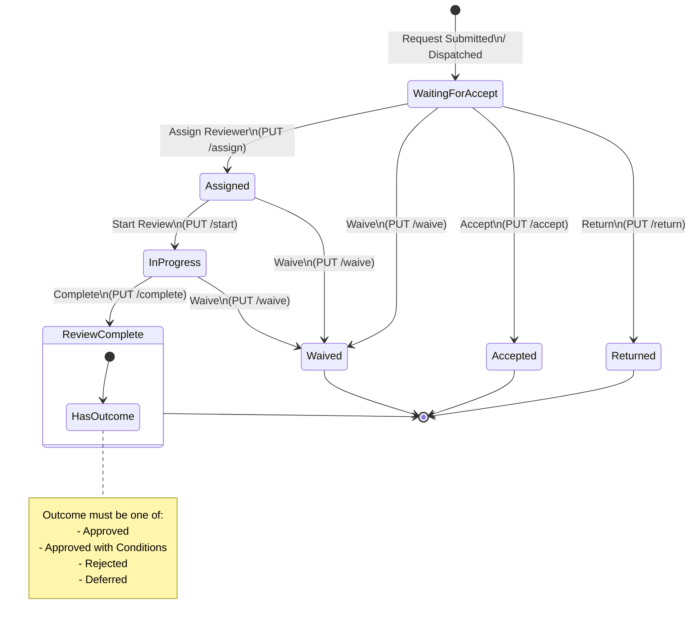
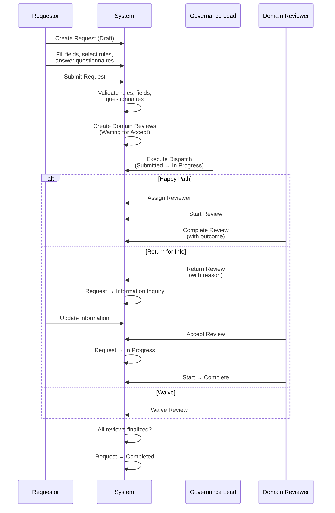

# EGM State Machine

This document describes the complete status lifecycle for **Governance Requests** and **Domain Reviews** in the EGM system.

---

## 1. Governance Request — Workflow Status

A governance request progresses through a linear workflow with one temporary branch state (Information Inquiry).

```mermaid
stateDiagram-v2
    direction LR

    [*] --> Draft : Create Request

    Draft --> Submitted : Submit\n(PUT /submit)
    Submitted --> InProgress : Dispatch\n(POST /dispatcher/execute)
    InProgress --> Completed : All Reviews\nFinalized

    InProgress --> InformationInquiry : Domain Review\nReturned
    InformationInquiry --> InProgress : Domain Review\nAccepted

    state Draft {
        direction LR
        [*] --> Editing
        Editing --> Editing : Save Draft
        note right of Editing
            Owner can edit all fields,
            select rules, answer
            domain questionnaires
        end note
    }

    state InformationInquiry {
        direction LR
        note right of InformationInquiry
            Triggered when a domain reviewer
            returns a review. Stepper shows
            "Information Inquiry - {Domain}"
        end note
    }
```

### Transition Details

| # | From | To | Endpoint | Who | Conditions | Side Effects |
|---|------|----|----------|-----|------------|--------------|
| 1 | **Draft** | **Submitted** | `PUT /{id}/submit` | Requestor (owner) | All required fields filled; mandatory rules satisfied; rule dependencies met; at least 1 domain triggered; required domain questionnaires answered | Creates `domain_review` records (status = "Waiting for Accept") for each triggered domain |
| 2 | **Submitted** | **In Progress** | `POST /dispatcher/execute/{id}` | Admin / Governance Lead | Request must be in Submitted status | Updates request status; may assign reviewers |
| 3 | **In Progress** | **Information Inquiry** | `PUT /domain-reviews/{reviewId}/return` | Domain Reviewer / Governance Lead | Domain review must be in "Waiting for Accept" status; return reason required | Sets domain review to "Returned"; request status → "Information Inquiry" |
| 4 | **Information Inquiry** | **In Progress** | `PUT /domain-reviews/{reviewId}/accept` | Domain Reviewer / Governance Lead | Domain review must be in "Waiting for Accept" status | Sets domain review to "Accepted"; request status → "In Progress" |
| 5 | **In Progress** | **Completed** | *(automatic / manual)* | System / Admin | All domain reviews finalized (Review Complete, Accepted, or Waived) | — |

> **Note:** Requestors can edit request fields and domain questionnaire answers in any status except Completed. All changes are tracked in `governance_request_change_log`.

---

## 2. Governance Request — Lifecycle Status

Lifecycle status is an **orthogonal dimension** independent of the workflow status. It controls visibility in the request list.



### Transition Details

| # | From | To | Endpoint | Who | Conditions |
|---|------|----|----------|-----|------------|
| 1 | **Active** | **Cancelled** | `PUT /{id}/cancel` | Requestor (owner) | Workflow status must be **Draft** |
| 2 | **Active** | **Archived** | `PUT /{id}/archive` | Admin / Governance Lead | Workflow status must be **Completed** |

> Cancelled and Archived are **terminal states** — no transitions back to Active.

---

## 3. Domain Review — Status Lifecycle

Each governance request can have multiple domain reviews (one per triggered governance domain). Each review follows its own lifecycle.



### Transition Details

| # | From | To | Endpoint | Who | Conditions | Side Effects |
|---|------|----|----------|-----|------------|--------------|
| 1 | *(created)* | **Waiting for Accept** | `PUT /{requestId}/submit` | System | Automatic on request submission | One review per triggered domain |
| 2 | **Waiting for Accept** | **Assigned** | `PUT /{reviewId}/assign` | Admin / Governance Lead | Reviewer itcode + name required | Sets `reviewer`, `reviewer_name` |
| 3 | **Waiting for Accept** / **Assigned** | **In Progress** | `PUT /{reviewId}/start` | Domain Reviewer only | Reviewer must be assigned to this domain | Sets `started_at` timestamp |
| 4 | **In Progress** | **Review Complete** | `PUT /{reviewId}/complete` | Domain Reviewer only | Outcome required (Approved / Approved with Conditions / Rejected / Deferred) | Sets `outcome`, `outcome_notes`, `completed_at` |
| 5 | **Waiting for Accept** | **Returned** | `PUT /{reviewId}/return` | Domain Reviewer / Governance Lead | Return reason required | Request status → **Information Inquiry**; sets `return_reason` |
| 6 | **Waiting for Accept** | **Accepted** | `PUT /{reviewId}/accept` | Domain Reviewer / Governance Lead | — | Request status → **In Progress** |
| 7 | **Any active status** | **Waived** | `PUT /{reviewId}/waive` | Admin / Governance Lead | — | Counts as "finalized" for progress |

### Domain Review Outcomes

When a review is completed (`status = "Review Complete"`), an outcome is recorded:

| Outcome | Meaning |
|---------|---------|
| **Approved** | Domain review passed without conditions |
| **Approved with Conditions** | Passed with conditions that must be addressed |
| **Rejected** | Domain review did not pass |
| **Deferred** | Decision deferred to a later date |

---

## 4. Permission Matrix

### Governance Request Actions

| Action | Requestor (Owner) | Domain Reviewer | Governance Lead | Admin |
|--------|:-:|:-:|:-:|:-:|
| Create / Edit Draft | Yes | — | — | — |
| Submit | Yes | — | — | — |
| Edit after Submit | Yes | — | — | — |
| Cancel (Draft) | Yes | — | — | Yes |
| Archive (Completed) | — | — | Yes | Yes |
| Copy | Yes | — | — | — |
| Execute Dispatch | — | — | Yes | Yes |

### Domain Review Actions

| Action | Domain Reviewer | Governance Lead | Admin |
|--------|:-:|:-:|:-:|
| Assign Reviewer | Own domains | Yes | Yes |
| Start Review | Own domains | **No** | Yes |
| Complete Review | Own domains | **No** | Yes |
| Return for Info | Own domains | Yes | Yes |
| Accept Review | Own domains | Yes | Yes |
| Waive Review | — | Yes | Yes |

> **Key restriction:** Governance Leads cannot **start** or **complete** domain reviews — only domain reviewers (and admins) can.

---

## 5. Combined View — Request + Domain Review Interaction



---

## 6. Progress Calculation

The `/progress/{requestId}` endpoint calculates review progress:

| Metric | Calculation |
|--------|-------------|
| **Completed domains** | Reviews where `status IN ('Review Complete', 'Waived')` |
| **Progress percent** | `(completed / total) * 100` |
| **Open info requests** | ISRs where `status IN ('Open', 'Acknowledged')` |

---

## Source Files

| File | Role |
|------|------|
| `backend/app/routers/governance_requests.py` | Submit, cancel, archive, copy endpoints |
| `backend/app/routers/domain_reviews.py` | Assign, start, complete, return, accept, waive |
| `backend/app/routers/dispatcher.py` | Execute dispatch (Submitted → In Progress) |
| `backend/app/routers/progress.py` | Progress calculation |
| `scripts/schema.sql` | Table definitions |
| `frontend/src/lib/constants.ts` | Status color mappings |
